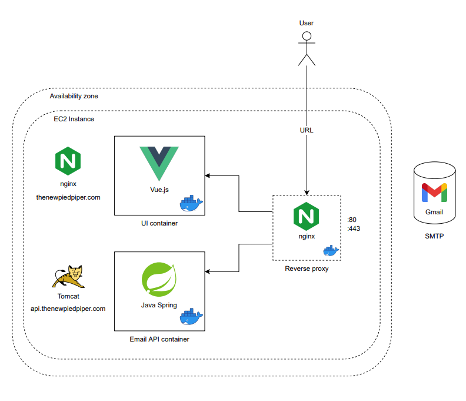

# Email APP
✉️ Email APP with Vue 3 + TypeScript + Vite


## Recommended IDE Setup

- [VS Code](https://code.visualstudio.com/) + [Volar](https://marketplace.visualstudio.com/items?itemName=Vue.volar)

## Requirements
For building and running the application you need:

- [Node 16.14.0](https://nodejs.org/download/release/v16.14.0/)
- [Yarn 1.22.17](https://classic.yarnpkg.com/lang/en/docs/install/)
## Running the application locally

### Install dependencies
```shell
yarn
```

### Run the app
```shell
yarn dev
```

## Try it out with Docker

First, build the application:

```shell
yarn build
```

Then you need to build the Docker image:

```shell
docker build -t email-app .
```
  
Now you can run the image:
  
```shell
docker run --name email-app -p 3000:3000 email-app
```

## Architecture Diagram

